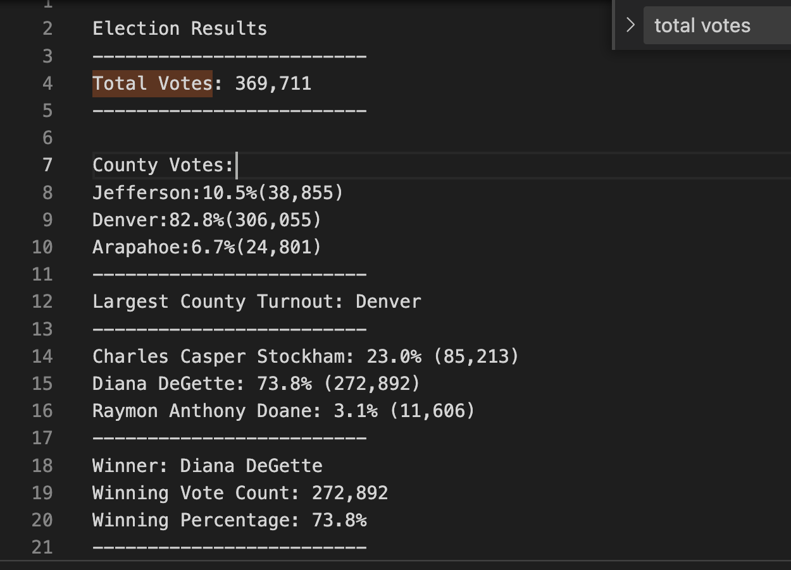

# PyPollModule3 
## Purpose: 
The purpose of the analysis was to complete the audit for additional data regarding the election. The audit consisted of the voter turnout for each county, the percentage of votes from each county out of the total count and the county with the highest turnout.  
  
## Election-Audit Results:
 

## Election-Audit Summary: 
This script can be used to to determine the amount of elections. You can also determine the votes for each county. 
